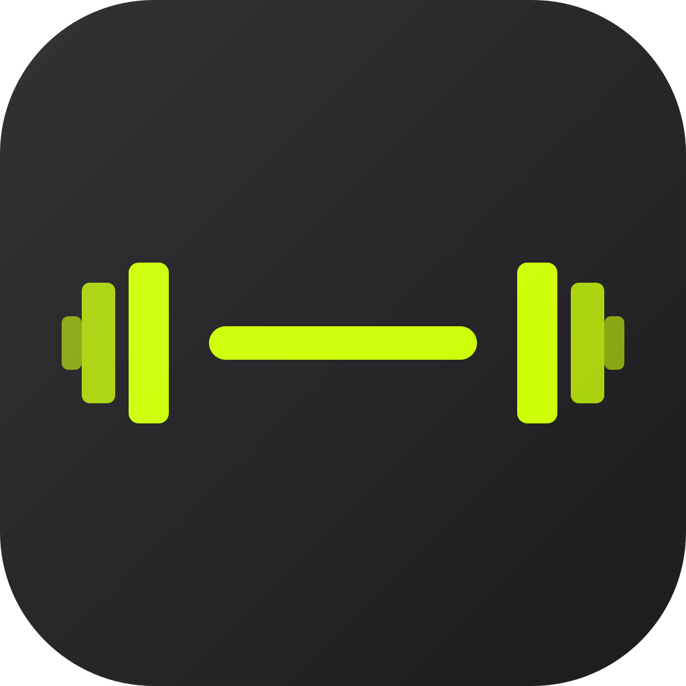
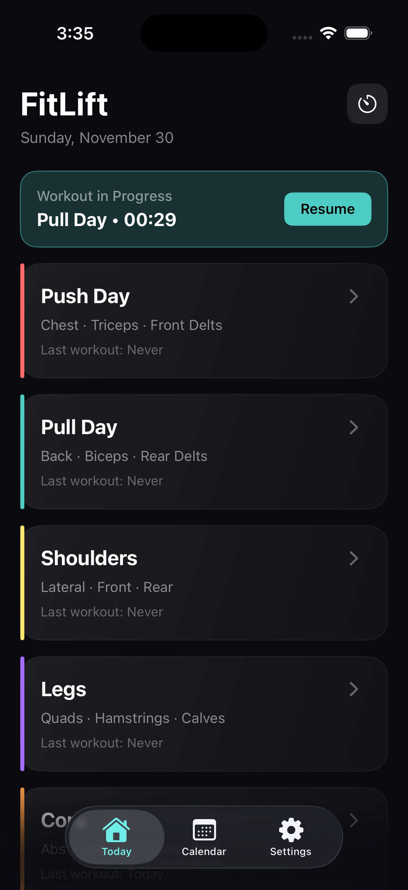
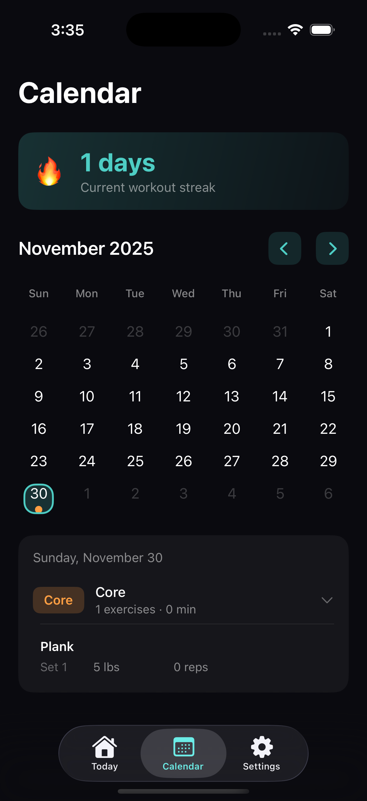
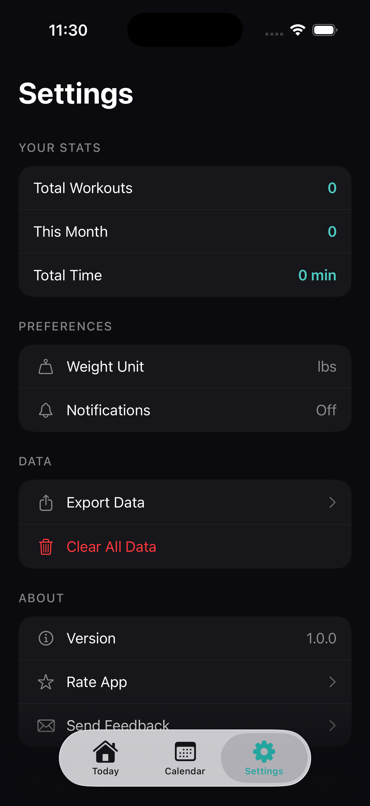

<h1> FitLift</h1>

iOS app for tracking your weightlifting workouts with Push/Pull/Legs/Shoulders/Core split.

## Screenshots

  
  
  
  

## Features

- **5 Workout Types**: Push, Pull, Shoulders, Legs, Core (color-coded)
- **Active Workout Tracking**: Timer, exercise logging, set tracking
- **Log Sets**: Track weight (lbs) and reps with +/- buttons
- **Calendar View**: Monthly grid showing workout history with color-coded dots
- **Workout Streak**: Track your consecutive workout days
- **Exercise Database**: Pre-loaded exercises organized by muscle group
- **Custom Exercises**: Add your own exercises
- **Dark Mode**: Beautiful dark theme optimized for gym use
- **Local Storage**: All data saved locally using SwiftData

## Workout Types

| Type | Color | Muscles |
|------|-------|---------|
| Push | Red | Chest, Triceps, Front Delts |
| Pull | Teal | Back, Biceps, Rear Delts |
| Shoulders | Yellow | Lateral, Front, Rear Delts |
| Legs | Purple | Quads, Hamstrings, Calves |
| Core | Orange | Abs, Obliques, Lower Back |

## License

This project is licensed under the MIT License - see the [LICENSE](LICENSE) file for details.
